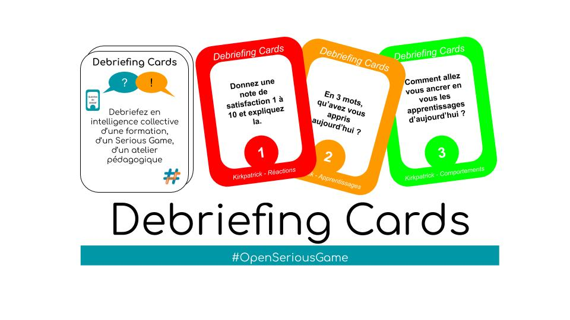

# Debriefing Cards

[Debriefing Cards sur OSG](https://openseriousgames.org/debriefing-cards/)

---
## Objectif

Utilisez l'intelligence collective pour débriefer une formation, un Serious Game, ou encore un atelier pédagogique.

## À télécharger

### Un kit prêt à l'emploi

Pour jouer à la version actuelle, il suffit de télécharger et d'imprimer les cartes [ici](kit/.pdf).

### Les sources

Toutes les sources sont diponibles directement sous [source](https://github.com/OpenSeriousGame/Debriefing-Cards/tree/master/source) dans ce dépôt.

## Comment contribuer ?

Vous pouvez cloner ce dépôt et proposer des améliorations ou tout simplement proposer de nouvelles idées de cartes [ici](https://github.com/OpenSeriousGame/Debriefing-Cards/issues).

---
## Format proposé

### Pré-requis

Durée : **? mn**  
Nombre de participants : **?**

### Préparation

À compléter.

### Le tour

Les Debriefing Cards sont des cartes à distribuer pour debriefer en intelligence collective, suivant le modèle de debriefing (Kirkpatrick, #OSG, …) de votre choix. Elles aident les participants à s’impliquer dans le debriefing tout en leur donnant des étapes : les petits groupes posent leurs questions entre eux/elles.

Augmenter la quantité d’échanges dans le temps limité du debriefing (permet aussi d’atteindre un grand nombre de participant(e)s)
Impliquer les participant(e)s dans le debriefing
Intégrer plus facilement des participant(e)s timides dans les phases debriefing
Mieux répartir le temps de parole dans les phases debriefing
Impliquer les participants dans les résultats attendus de la formation / du Serious Game / de l’atelier
Rendre agréable et collectif une phase de debriefing

Format idéal pour des grands groupes de 30 à 100 dans lesquels un debriefing centralisé est difficile.

---
## Contributeurs

Merci à .

## Licence

`Workshop` est proposé en [Creative Commons BY 3.0](https://creativecommons.org/licenses/by/3.0/fr/) : Attribution 3.0 France.
